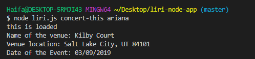

# liri-node-app

### Overview

In this app you will be able to search for information about songs, concerts and movies. 

1. **You can run the app using the below command line**.

```node liri.js```


If you hit enter, you will get the following error message. 


2. **You can search for the song that you want to listen using the below command line**.

```node liri.js spotify-this-song [song name]```


If you hit enter without entering a song name, you will get information about "The Sign" song. 


3. **You can search for a concert using the below command line**.

```node liri.js concert-this [artist name]```



If you hit enter without entering an artist name, you will get the following error message. 


4. **You can search for a amovie using the below command line**.

```node liri.js movie-this [movie name]```


If you hit enter without entering a movie name, you will get information about "Mr. Nobody" movie. 


4. **Log File**.

Each time you search for information, your results will be logged to log.texe file


